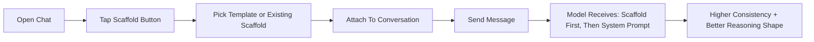

<p align="center">
  
  
</p>

<p align="center">
  SEER is a native iOS and macOS client for Ollama Cloud with streaming chat, model controls, and reasoning scaffolds.
</p>

---

## Platform Overview

SEER ships as two native apps from a [shared codebase](OllamaCloud/Sources). Platform-specific behavior is gated behind `#if os(macOS)` / `#if os(iOS)` — the two targets never diverge in business logic, only in UI and system capabilities.

| | **macOS** | **iOS** |
|---|---|---|
| **Scheme** | `OllamaCloudMac` | `OllamaCloud` |
| **Min version** | macOS 14.0 | iOS 17.0 |
| **Code execution** | Python, JavaScript, Shell | JavaScript only |
| **Haptics** | `NSHapticFeedbackManager` | `UIImpactFeedbackGenerator` |
| **Clipboard** | `NSPasteboard` | `UIPasteboard` |
| **Sheet sizing** | Fixed-frame windows | Presentation detents |

---

## Features (Both Platforms)

- Stream chat completions from Ollama Cloud API
- Collapsible thinking/reasoning display for supported models
- Live streaming stats during generation (thinking chars, chars, chunks, throughput)
- Conversation management with pin/unpin and delete actions
- Per-conversation model selection and parameter tuning (temperature, top-p, top-k, penalties, etc.)
- Built-in `SEER` virtual model profile pinned by default for fast concise guidance
- Reasoning Scaffold library with templates, guided builder, search, attach/swap/clear
- Composer scaffold button + active scaffold chip for one-tap control
- Runtime scaffold injection ahead of system prompt for deterministic context shaping
- Long-press chat actions: Copy, Edit Prompt, Regenerate
- Rich code blocks: syntax highlighting, line numbers, copy, auto/manual collapse
- Inline code execution with Run button — output displayed inline below the code block
- Interactive input detection: snippets using `input()`, `prompt()`, or `read` are rejected pre-flight with a friendly message
- Account-scoped persistence for chats, scaffolds, and favorites
- Keychain-secured API key storage
- Network monitoring with offline detection, retry logic, and certificate pinning
- Dark-mode-first UI with wide-tracked typography

---

## macOS Features

The macOS app has additional capabilities that take advantage of the desktop environment.

| Feature | Description | Code |
|---|---|---|
| **Full code execution** | Run Python, JavaScript, and Shell via `Process` with stdin/stdout piping and timeout | [`CodeExecutionService.swift:73`](OllamaCloud/Sources/Services/CodeExecutionService.swift#L73) |
| **SEER dock name** | App displays as "SEER" in the dock via `PRODUCT_NAME` | [`project.yml:68`](project.yml#L68) |
| **Sidebar emblem** | SeerEmblem header at top of conversation list | [`ConversationListView.swift:39`](OllamaCloud/Sources/Views/ConversationListView.swift#L39) |
| **Sidebar New Chat button** | Persistent `+ NEW CHAT` capsule at bottom of sidebar | [`ConversationListView.swift:121`](OllamaCloud/Sources/Views/ConversationListView.swift#L121) |
| **Detail empty state** | SeerEmblem + New Chat button when no conversation selected | [`RootView.swift:52`](OllamaCloud/Sources/App/RootView.swift#L52) |
| **Native sheet sizing** | Fixed-frame sheets via `macSheetFixedSize()` helper | [`SheetSizing.swift`](OllamaCloud/Sources/Utils/SheetSizing.swift) |
| **DONE button styling** | Bordered button style with readable foreground | [`ParametersView.swift:272`](OllamaCloud/Sources/Views/ParametersView.swift#L272) |
| **Window constraints** | Min 800x500, default 1100x700 | [`OllamaCloudApp.swift:39`](OllamaCloud/Sources/App/OllamaCloudApp.swift#L39) |
| **macOS haptics** | `NSHapticFeedbackManager` integration | [`Theme.swift`](OllamaCloud/Sources/Utils/Theme.swift) |

---

## iOS Features

| Feature | Description | Code |
|---|---|---|
| **JavaScript execution** | Run JS via JavaScriptCore with console.log capture | [`CodeExecutionService.swift:219`](OllamaCloud/Sources/Services/CodeExecutionService.swift#L219) |
| **Presentation detents** | Sheets use `.medium` / `.large` detents with drag indicator | [`ChatView.swift:114`](OllamaCloud/Sources/Views/ChatView.swift#L114) |
| **Toolbar placement** | `.topBarLeading` / `.topBarTrailing` for native iOS nav | [`Theme.swift`](OllamaCloud/Sources/Utils/Theme.swift) |
| **iOS haptics** | `UIImpactFeedbackGenerator` / `UINotificationFeedbackGenerator` | [`Theme.swift`](OllamaCloud/Sources/Utils/Theme.swift) |
| **Clipboard** | `UIPasteboard` for copy actions | [`SeerCodeBlock.swift:328`](OllamaCloud/Sources/Views/SeerCodeBlock.swift#L328) |

---

## Reasoning Scaffolds

Reasoning Scaffolds are structured context blocks that guide *how* the model thinks, not just *what* it says.

- Build reusable scaffolds in a guided form with live preview
- Attach one scaffold per chat from the composer or parameters
- Swap or clear instantly without breaking conversation flow
- Merge order is deterministic: `Scaffold system block` -> `System prompt` -> `Chat history` -> `User message`
- Edits are live-linked across chats using that scaffold

### Built-In Templates

| Template | Best For | What It Pushes |
|---|---|---|
| `Mantic` | Structural reasoning and hidden constraint analysis | Multi-layer thinking, tension/alignment detection, clear next move |
| `Code Expert/Reviewer` | Engineering reviews and technical QA | Severity-first findings, concrete fixes, testing gaps |
| `Tutor` | Teaching and explanations | Progressive explanation and understanding checks |
| `Technical Debugger` | Bug hunts and incidents | Repro-first diagnosis and lowest-risk fix path |
| `Decision Coach` | Tradeoff decisions | Criteria-based comparison and recommendation |
| `Creative Strategist` | Frontend UI/UX direction | Distinct design concepts plus implementation guidance |
| `Marketing/Sales Expert` | Go-to-market and revenue motions | ICP clarity, offer/message, funnel and sales actions |

### Scaffold UX Flow



### Why It Feels Better In Practice

- Less prompt micromanagement for every single message
- Better response consistency across longer chats
- Faster reuse of proven workflows (debugging, planning, GTM, UI/UX)
- Easier onboarding for users who are not prompt engineers

---

## Built-In SEER Assistant Profile

The app ships with a first-class `SEER` model profile for onboarding and product guidance.

- Preloaded into the model list even when not returned by `/api/tags`
- Seeded as a default favorite per account scope (users can unpin any time)
- Backed by cloud model `qwen3.5:397b-cloud` by default
- Uses a dedicated system profile prompt for app/codebase help
- Tuned for concise responses and lower verbosity
- Sends requests with `think=false` to avoid long reasoning dumps in normal SEER usage

Environment overrides (Xcode scheme or process env):

- `SEER_MODEL_ENABLED` (`true`/`false`)
- `OLLAMA_SEER_MODEL_NAME` (alias shown in app, default `SEER`)
- `OLLAMA_SEER_BACKING_MODEL` (runtime model name, default `qwen3.5:397b-cloud`)
- Legacy aliases also supported: `SEER_ALIAS_NAME`, `SEER_UPSTREAM_MODEL`

---

## Inline Code Execution

Code blocks include a **Run** button for supported languages. Output is ephemeral and displayed inline.

| | macOS | iOS |
|---|---|---|
| **Python** | `/usr/bin/python3` via `Process` | Not available |
| **JavaScript** | `/usr/bin/env node` via `Process` | `JavaScriptCore` (no Node APIs) |
| **Shell** | `/bin/bash` via `Process` | Not available |
| **Timeout** | 10 seconds | None (JSC is synchronous) |
| **Interactive input** | Detected and rejected pre-flight | N/A |

Interactive patterns (`input()`, `prompt()`, shell `read`) are detected before execution and return a friendly message instead of hanging or crashing. If detection is bypassed, runtime EOF errors are normalized to the same message.

See: [`CodeExecutionService.swift`](OllamaCloud/Sources/Services/CodeExecutionService.swift) | [`SeerCodeBlock.swift`](OllamaCloud/Sources/Views/SeerCodeBlock.swift)

---

## Requirements

- iOS 17.0+ / macOS 14.0+
- Xcode 16+
- An [Ollama Cloud](https://ollama.com) API key

## Build

```
brew install xcodegen
cd /path/to/repo
xcodegen generate
open OllamaCloud.xcodeproj
```

## Run iOS Simulator

Always use this script to avoid installing stale builds from multiple DerivedData folders:

```
./scripts/run_ios_sim.sh
```

Defaults:
- Device: `iPhone 17 Pro`
- Derived data: `/tmp/OllamaCloud-DerivedData`

## Run macOS

```
xcodegen generate
xcodebuild build -scheme OllamaCloudMac -destination 'platform=macOS,arch=arm64' -quiet
open "$(ls -td ~/Library/Developer/Xcode/DerivedData/OllamaCloud*/Build/Products/Debug/SEER.app | head -1)"
```

Or open `OllamaCloud.xcodeproj` in Xcode and select the `OllamaCloudMac` scheme.

## Optional Backend Relay

This repo includes a lightweight relay backend in `backend/` for rate limiting, model policy, and observability while keeping the same app UX.

```
cd backend
cp .env.example .env
set -a && source .env && set +a
npm install
npm run start
```

To point the app to the relay in development, set one or both environment variables in your Xcode scheme:

- `OLLAMA_API_BASE_URL` (example: `http://localhost:8787`)
- `OLLAMA_BACKEND_BEARER_TOKEN` (only if backend auth is enabled)

See `backend/README.md` for production deployment configuration.

## License

All rights reserved. No license granted at this time.
