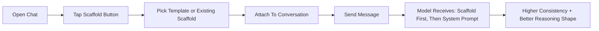

<p align="center">
  
  
</p>

<p align="center">
  <b>A native AI chat client for iPhone and Mac — built for people who want more from their models.</b>
</p>

<p align="center">
  Streaming conversations &nbsp;·&nbsp; Reasoning scaffolds &nbsp;·&nbsp; Inline code execution &nbsp;·&nbsp; MCP tool calling &nbsp;·&nbsp; One codebase, two platforms
</p>

<p align="center">
  <a href="https://github.com/Cole-Cant-Code/Ollama-Cloud-App/releases/latest/download/SEER-macos.dmg"><b>Download macOS (Direct)</b></a>
</p>

---

## Why SEER

Most AI chat apps give you a text box and a send button. SEER gives you control over *how* the model thinks — not just what you ask it.

**Reasoning Scaffolds** let you attach structured guidance to any conversation so the model follows a proven thinking pattern every time. No prompt engineering required. Pick a template, attach it, and your responses get sharper — whether you're debugging code, making a business decision, or reviewing a pull request.

**Run code in the conversation.** When the model writes a Python script, a shell command, or a JavaScript snippet, tap Run and see the output right there in the chat. No copy-pasting to a terminal. On iOS, JavaScript runs natively — no external tools needed.

**MCP tool calling on Mac** means models can reach beyond the chat window. Connect filesystem access, web search, GitHub, databases, browser automation, and more — all through the open Model Context Protocol standard. SEER manages server lifecycles, routes tool calls, and displays results inline.

**One shared codebase, two truly native apps.** SEER is built entirely in SwiftUI and SwiftData. No Electron. No web views. No compromise. It feels like it belongs on your device because it does.

---

## At a Glance

<table>
<tr>
<td width="50%">

**For Everyone**
- Stream responses from 100+ cloud models via Ollama
- Rich Markdown rendering with syntax-highlighted code blocks
- Collapsible thinking/reasoning sections for supported models
- Pin, search, and organize conversations
- Dark-mode-first OLED-optimized interface
- Keychain-secured API key storage
- Offline detection with automatic retry

</td>
<td width="50%">

**For Power Users**
- Reasoning Scaffolds — reusable thinking frameworks
- Per-conversation parameter tuning (temperature, top-p, top-k, penalties, seeds, and more)
- Inline code execution with input panel for stdin values
- MCP tool integration with built-in and custom servers (macOS)
- Drag-and-drop files into chat as code blocks (macOS)
- Export conversations to Markdown (macOS)
- Full keyboard-driven workflow (macOS)

</td>
</tr>
</table>

---

## What Makes SEER Different

### Reasoning Scaffolds — shape how the model thinks

Other chat apps let you set a system prompt. SEER goes further with **Reasoning Scaffolds** — structured context blocks that guide the model's thinking pattern, not just its persona.

A scaffold defines role, perspective, tone, ordered reasoning steps, output format, constraints, and guardrails. When attached to a conversation, it's injected *ahead* of the system prompt in a deterministic merge order, giving you repeatable, higher-quality reasoning without rewriting prompts for every chat.

Build your own in a guided form with live preview, or start from one of seven built-in templates:

| Template | Use Case | What It Drives |
|---|---|---|
| **Mantic** | Structural reasoning and hidden constraint analysis | Multi-layer thinking, tension/alignment detection, actionable next move |
| **Code Expert / Reviewer** | Engineering reviews and technical QA | Severity-first findings, concrete fixes, testing gaps |
| **Tutor** | Teaching and explanations | Progressive explanation depth with understanding checks |
| **Technical Debugger** | Bug hunts and incident response | Repro-first diagnosis, lowest-risk fix path |
| **Decision Coach** | Tradeoff decisions | Criteria-based comparison with clear recommendation |
| **Creative Strategist** | Frontend UI/UX direction | Distinct design concepts with implementation guidance |
| **Marketing / Sales Expert** | Go-to-market and revenue motions | ICP clarity, messaging, funnel strategy, sales actions |

Scaffolds are saved to your library, editable any time, and live-linked across every conversation that uses them — update once, every chat benefits.



**Why this matters in practice:**
- Stop micromanaging prompts for every message
- Get consistent response quality across long conversations
- Reuse proven workflows (debugging, planning, GTM, design review) instantly
- Onboard team members who aren't prompt engineers — just pick a scaffold

---

### Inline Code Execution — run it right in the chat

When a model generates a code block in a supported language, SEER adds a **Run** button directly on the block. Tap it and see stdout, stderr, and exit codes rendered inline — no context switching to a terminal or IDE.

| | macOS | iOS |
|---|---|---|
| **Python** | Native via `/usr/bin/python3` | — |
| **JavaScript** | Node.js (auto-detected) with JavaScriptCore fallback | JavaScriptCore (built-in, no install required) |
| **Shell** | Native via `/bin/bash` | — |
| **Timeout** | 10 seconds per run | Synchronous (no timeout needed) |
| **Stdin Input** | Input panel (one value per line) | Input panel (one value per line) |
| **Sandbox** | Ephemeral temp workspace, cleaned after each run | Isolated JavaScriptCore context |

**Input Panel:** Code that uses `input()`, `prompt()`, or `readLine()` can receive predefined values through a toggle panel on the code block. Values are consumed line-by-line, and the app shows a clear error if the program requests more input than provided.

**Smart JavaScript routing on macOS:** SEER resolves Node.js from Homebrew, nvm, fnm, and volta paths. Code using browser-style `prompt()` is automatically routed to JavaScriptCore even when Node is available, so it just works. If Node isn't installed, compatible code still runs via JavaScriptCore with guidance shown for Node-specific APIs.

---

### MCP Tool Calling — give your models real capabilities (macOS)

SEER includes a native [Model Context Protocol](https://modelcontextprotocol.io) client that lets models call external tools during a conversation. Ask a model to read a file, search the web, query a database, or automate a browser — and it can actually do it.

**How it works:**
1. Configure MCP servers in `~/.seer/mcp.json` (same format as Claude Desktop)
2. SEER spawns servers via stdio transport and discovers their tools
3. Tools are sent alongside chat requests to Ollama
4. When the model returns a tool call, SEER executes it and feeds the result back
5. Tool call and result bubbles appear inline in the conversation

**Safety guardrails** are built in: 30-second timeout per tool call, maximum 10 tool-call rounds per turn to prevent runaway loops.

**Built-in servers** (toggle on/off in Settings):

| Server | What It Does |
|---|---|
| **Filesystem** | Read, write, and search files on your machine |
| **Desktop Commander** | Run shell commands, manage processes, system control |
| **Mantic** | Advanced scaffold reasoning engine |

**Installable from the MCP Library** (one-tap install in Settings):

| Server | What It Does |
|---|---|
| **Memory** | Persistent note-taking and retrieval |
| **Sequential Thinking** | Structured multi-step reasoning tools |
| **GitHub** | Repository and issue operations via GitHub API |
| **Brave Search** | Web search with Brave API |
| **Postgres** | Query and inspect PostgreSQL databases |
| **Puppeteer** | Browser automation and page interaction |

**Custom servers:** Add any MCP-compatible server to `~/.seer/mcp.json`:

```json
{
  "mcpServers": {
    "filesystem": {
      "command": "npx",
      "args": ["-y", "@modelcontextprotocol/server-filesystem", "/Users/you"],
      "env": {}
    }
  }
}
```

Server status, restart controls, and tool counts are visible in **Settings > MCP Servers**.

---

### SEER Assistant — your built-in guide

Every installation ships with a **SEER** model profile pinned to your favorites. It's designed to help you get the most out of the app.

- Always available in the model picker, even before your first API call
- Backed by `qwen3.5:397b-cloud` — a fast, capable cloud model
- Tuned for concise, direct responses (temperature 0.15, capped at 512 tokens)
- Knows every feature, every screen, every platform difference in the app
- Thinking mode is disabled to keep answers fast and focused
- Distinguishes iOS vs macOS behavior and calls out platform-specific prerequisites

SEER isn't a gimmick — it's a practical onboarding companion that understands the product deeply.

---

## Platform Overview

SEER ships as two native apps from a [shared codebase](OllamaCloud/Sources). Platform-specific behavior is gated behind `#if os(macOS)` / `#if os(iOS)` — the two targets never diverge in business logic, only in UI and system capabilities.

| | **macOS** | **iOS** |
|---|---|---|
| **Min version** | macOS 14.0 (Sonoma) | iOS 17.0 |
| **Streaming chat** | Yes | Yes |
| **Reasoning scaffolds** | Yes | Yes |
| **Model parameters** | Yes | Yes |
| **Image attachments** | Yes | Yes |
| **File attachments** | Yes (+ drag & drop) | Yes (file picker) |
| **Code execution** | Python, JavaScript, Shell | JavaScript |
| **MCP tools** | Yes (`~/.seer/mcp.json`) | — |
| **Thinking / reasoning display** | Yes | Yes |
| **Keyboard shortcuts** | Cmd+N, Cmd+Enter, Cmd+K, Cmd+1/2/3, and more | Standard iOS |
| **Export to Markdown** | Yes | — |
| **Haptics** | `NSHapticFeedbackManager` | `UIImpactFeedbackGenerator` |

---

## Core Features

### Streaming Chat

SEER connects to Ollama Cloud's API and streams responses token-by-token with live performance metrics. During generation you see:

- **Token count** — how many tokens have been generated so far
- **Tokens per second** — real-time throughput measurement
- **Thinking indicator** — when models with extended reasoning are working through a problem

Streaming is optimized with a 40ms UI flush interval and debounced Markdown rendering, keeping the interface smooth even on long responses.

### Thinking & Reasoning Display

Models that support extended thinking (chain-of-thought) get special treatment. The model's internal reasoning appears in a collapsible section above the response — you can expand it to see how the model arrived at its answer, or collapse it to focus on the result.

Three thinking modes are available per conversation:
- **Auto** — enabled by default for all models (except SEER)
- **On** — force extended reasoning
- **Off** — disable thinking for faster, shorter responses

### Conversation Management

- **Pin** important conversations to the top of your list
- **Search** across all your conversations
- **Delete** conversations you no longer need
- **Per-conversation settings** — each chat remembers its own model, parameters, scaffold, and system prompt
- **Automatic titling** — conversations get named based on their content
- **Account-scoped storage** — different API keys maintain completely separate conversation histories

### Model Selection & Parameters

Browse and search available models from Ollama Cloud. Favorite the ones you use most, and hide everything else for a clean picker.

Every conversation supports independent parameter tuning:

| Parameter | Range | What It Controls |
|---|---|---|
| Temperature | 0.0 – 2.0 | Randomness / creativity |
| Top-P | 0.0 – 1.0 | Nucleus sampling threshold |
| Top-K | 1 – 200 | Categorical cutoff |
| Min-P | 0.0 – 1.0 | Minimum probability filter |
| Typical-P | 0.0 – 1.0 | Typical completion threshold |
| Repeat Penalty | 0.0 – 3.0 | Discourages repetition |
| Presence Penalty | -2.0 – 2.0 | Penalizes token reuse |
| Frequency Penalty | -2.0 – 2.0 | Penalizes frequent tokens |
| Max Tokens | 1 – 32768 | Output length cap |
| Seed | Any integer | Reproducible outputs |

Three quick-pick presets get you started fast: **Creative** (high temperature, high diversity), **Balanced** (moderate settings), and **Precise** (low temperature, focused output).

### Rich Code Blocks

Code in responses is rendered with full syntax highlighting, line numbers, and language detection. Blocks longer than 20 lines auto-collapse to keep the conversation readable. Every code block includes a **Copy** button, and supported languages get the **Run** button for inline execution.

### Message Actions

Long-press (or right-click on Mac) any message for quick actions:
- **Copy** — copy the full message content
- **Edit Prompt** — modify a sent message and regenerate the response
- **Regenerate** — get a fresh response to the same prompt

### Image & File Attachments

Attach images for vision-capable models using the native photo picker (iOS) or drag-and-drop (macOS). Attach text files (`.swift`, `.py`, `.js`, `.json`, `.md`, `.txt`, and more) and they're inserted as fenced code blocks in your message — up to 100KB per file.

---

## macOS Features

The macOS app takes full advantage of the desktop environment with capabilities that go beyond the shared feature set.

### Keyboard Shortcuts

| Shortcut | Action |
|---|---|
| `Cmd+N` | New Chat |
| `Cmd+Enter` | Send Message |
| `Cmd+K` | Quick Model Switch |
| `Cmd+,` | Settings |
| `Cmd+Shift+E` | Export Conversation as Markdown |
| `Cmd+Shift+W` | Close Chat |
| `Cmd+1` / `Cmd+2` / `Cmd+3` | Jump to conversation by position |

### Desktop Capabilities

- **Full code execution** — Python, JavaScript, and Shell run natively via system processes with stdin/stdout piping and 10-second timeout
- **MCP tool integration** — connect models to external tools via the Model Context Protocol (see [MCP section](#mcp-tool-calling--give-your-models-real-capabilities-macos) above)
- **Drag & drop files** — drop source code, configs, and text files directly into chat
- **Export to Markdown** — save any conversation as a `.md` file with properly collapsed thinking blocks
- **Native window management** — minimum 800×500, default 1100×700, with proper sidebar + detail layout
- **macOS haptics** — subtle haptic feedback throughout the interface

---

## iOS Features

SEER on iOS is a fully featured mobile client — not a stripped-down companion app.

- **JavaScript execution** — run JS code blocks natively via JavaScriptCore, no installs needed
- **Native iOS navigation** — proper toolbar placement, presentation detents, and drag indicators on sheets
- **iOS haptics** — `UIImpactFeedbackGenerator` and `UINotificationFeedbackGenerator` for tactile feedback
- **Photo picker** — attach images from your library for vision-capable models
- **File importer** — attach text files directly from the Files app
- **Full scaffold support** — same Reasoning Scaffold library and builder as macOS
- **Full parameter control** — same model tuning capabilities as macOS

Everything that runs on macOS — streaming, scaffolds, model parameters, thinking display, conversation management, favorites, search — runs on iOS too. The only differences are capabilities that require desktop-level system access (MCP servers, Python/Shell execution, drag-and-drop, export).

---

## Security & Privacy

- **Keychain storage** — your API key is stored in the system Keychain with device-locked accessibility, never in plain text or UserDefaults
- **Account isolation** — conversations, scaffolds, and favorites are scoped by a SHA-256 fingerprint of your API key and host. Different accounts never see each other's data
- **Ephemeral code execution** — code runs in a scoped temp workspace that's cleaned up after every execution. No persistent side effects
- **Network monitoring** — real-time connectivity detection with offline banners and automatic retry logic
- **MCP guardrails** — tool calls are individually time-limited (30s) and round-capped (10 per turn) to prevent runaway execution
- **No telemetry to third parties** — SEER does not phone home. Your conversations stay on your device and go to the API endpoint you configure

---

## Optional Backend Relay

This repo includes a production-grade relay backend in `backend/` for teams and deployments that need centralized control.

- **Auth modes** — none (dev), static bearer token, or JWT (HS256)
- **Rate limiting** — distributed via Redis, with in-memory fallback for local development
- **Upstream resilience** — retry, timeout, and circuit breaker for Ollama Cloud requests
- **SEER model routing** — expose the SEER virtual model at the backend level with server-side system prompt injection
- **Observability** — request ID propagation, structured JSON logs, admin metrics endpoint
- **Security headers** — CORS allowlist, security headers, and graceful shutdown
- **Health checks** — readiness and liveness endpoints for container orchestration

```bash
cd backend
cp .env.example .env
set -a && source .env && set +a
npm install
npm run start
```

Point the app to your relay by setting environment variables in your Xcode scheme:

- `OLLAMA_API_BASE_URL` — e.g. `http://localhost:8787`
- `OLLAMA_BACKEND_BEARER_TOKEN` — if backend auth is enabled

See [`backend/README.md`](backend/README.md) for full production deployment configuration.

---

## Getting Started

[Download macOS (Direct)](https://github.com/Cole-Cant-Code/Ollama-Cloud-App/releases/latest/download/SEER-macos.dmg)

### Choose Your Path

| Goal | Start Here |
|---|---|
| Install SEER on macOS right now (no Xcode) | [Download latest macOS build](https://github.com/Cole-Cant-Code/Ollama-Cloud-App/releases/latest/download/SEER-macos.dmg) |
| Build, modify, or contribute to the app | [Build from Source](#build-from-source) |

For direct macOS installs, Xcode is not required.

### Requirements

- **iOS 17.0+** or **macOS 14.0+** (Sonoma)
- **Xcode 16+**
- An [Ollama Cloud](https://ollama.com) API key

### Build from Source (Developers)

```bash
brew install xcodegen
cd /path/to/repo
xcodegen generate
open OllamaCloud.xcodeproj
```

Select the **OllamaCloud** scheme for iOS or **OllamaCloudMac** for macOS, then build and run.

### Run on iOS Simulator (Developers)

```bash
./scripts/run_ios_sim.sh
```

Defaults to iPhone 17 Pro with a clean DerivedData path to avoid stale builds.

### Run on macOS (Developers)

```bash
xcodegen generate
xcodebuild build -scheme OllamaCloudMac -destination 'platform=macOS,arch=arm64' -quiet
open "$(ls -td ~/Library/Developer/Xcode/DerivedData/OllamaCloud*/Build/Products/Debug/SEER.app | head -1)"
```

Or open `OllamaCloud.xcodeproj` in Xcode and select the `OllamaCloudMac` scheme.

### Direct macOS Distribution (Outside App Store)

If you want to ship a direct-download Mac app (website/download link), use the signing + notarization pipeline documented here:

- [`docs/MACOS_DIRECT_DISTRIBUTION.md`](docs/MACOS_DIRECT_DISTRIBUTION.md)

The included script handles build, Developer ID signing, Apple notarization, stapling, and packaging into `.zip`/`.dmg`.

For one-click downloads, upload `SEER-macos.dmg` to each GitHub Release so this stable link always works:

- [Download latest macOS build](https://github.com/Cole-Cant-Code/Ollama-Cloud-App/releases/latest/download/SEER-macos.dmg)

---

## Configuration

### Environment Variables

These can be set in your Xcode scheme or as process environment variables:

| Variable | Default | Description |
|---|---|---|
| `OLLAMA_API_BASE_URL` | `https://ollama.com` | API endpoint for Ollama Cloud (or your relay) |
| `OLLAMA_BACKEND_BEARER_TOKEN` | — | Bearer token for authenticated backend relay |
| `SEER_MODEL_ENABLED` | `true` | Enable or disable the built-in SEER model profile |
| `OLLAMA_SEER_MODEL_NAME` | `SEER` | Display name for the SEER model in the picker |
| `OLLAMA_SEER_BACKING_MODEL` | `qwen3.5:397b-cloud` | Cloud model that powers SEER responses |

### MCP Configuration (macOS)

Create `~/.seer/mcp.json` to add custom MCP servers. The format is compatible with Claude Desktop:

```json
{
  "mcpServers": {
    "your-server": {
      "command": "npx",
      "args": ["-y", "your-mcp-package"],
      "env": {}
    }
  }
}
```

Built-in and library servers can be toggled and installed directly from **Settings > MCP Servers** in the app.

---

## Architecture

SEER is built entirely in **SwiftUI** with **SwiftData** for persistence and **MarkdownUI** for rich content rendering. The codebase is organized for clarity:

```
OllamaCloud/Sources/
├── App/            # App entry point, root navigation, commands
├── Models/         # SwiftData models (Conversation, Message, Scaffold, MCP config)
├── Services/       # Streaming chat, code execution, MCP client, SEER profile
├── Utils/          # Theme, haptics, app config, telemetry, helpers
└── Views/          # All UI — chat, composer, model picker, scaffolds, settings
```

Both iOS and macOS targets share this source tree. Platform-specific behavior is handled with `#if os(iOS)` / `#if os(macOS)` — the two apps never diverge in business logic, only in UI and system-level capabilities.

---

## Open Source + Commercial Direction

SEER uses a pragmatic model:

- **Core app is open source** under Apache-2.0 to maximize adoption and community contributions
- **Brand remains protected** (`SEER` name and logos are reserved; see [`TRADEMARKS.md`](TRADEMARKS.md))
- **Commercialization happens above the core** through optional paid offerings (for example managed sync, team collaboration, premium MCP packs, hosted services, and priority support)

This keeps the app accessible for builders while preserving room for sustainable monetization.

---

## Contributing

Contributions are welcome. Start with [`CONTRIBUTING.md`](CONTRIBUTING.md) for development workflow, PR expectations, and CLA policy notes.

---

## Release Tracking

SEER ships iOS and macOS apps from one repository, but each platform is submitted and reviewed independently in App Store Connect.

Canonical workflow (versioning, tags, labeling, direct-download, and App Store sequencing):

- [`docs/RELEASE_WORKFLOW.md`](docs/RELEASE_WORKFLOW.md)

Supporting references:

- [`docs/RELEASE_VERSIONING.md`](docs/RELEASE_VERSIONING.md)
- [`docs/MACOS_DIRECT_DISTRIBUTION.md`](docs/MACOS_DIRECT_DISTRIBUTION.md)

---

## License

Licensed under the Apache License, Version 2.0.

- Full license text: [`LICENSE`](LICENSE)
- Attribution notice: [`NOTICE`](NOTICE)
- Trademark policy: [`TRADEMARKS.md`](TRADEMARKS.md)
