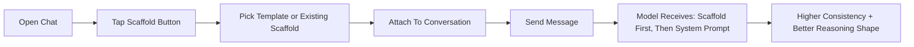

<p align="center">
  
  
</p>

<p align="center">
  SEER is a native iOS and macOS client for Ollama Cloud with streaming chat and model controls.
</p>

<p align="center">
  <strong>Now with first-class Reasoning Scaffolds:</strong> reusable thinking frameworks you can attach to any chat in one tap.
</p>

<p align="center">
  <strong>Also includes a built-in SEER assistant profile:</strong> preloaded, pinned by default, and tuned for fast concise in-app guidance.
</p>

---

## Reasoning Scaffolds (Front And Center)

Reasoning Scaffolds are structured context blocks that guide *how* the model thinks, not just *what* it says.

- Build reusable scaffolds in a guided form with live preview
- Attach one scaffold per chat from the composer or parameters
- Swap or clear instantly without breaking conversation flow
- Merge order is deterministic: `Scaffold system block` -> `System prompt` -> `Chat history` -> `User message`
- Edits are live-linked across chats using that scaffold

### Built-In Templates

| Template | Best For | What It Pushes |
|---|---|---|
| `Mantic` | Structural reasoning and hidden constraint analysis | Multi-layer thinking, tension/alignment detection, clear next move |
| `Code Expert/Reviewer` | Engineering reviews and technical QA | Severity-first findings, concrete fixes, testing gaps |
| `Tutor` | Teaching and explanations | Progressive explanation and understanding checks |
| `Technical Debugger` | Bug hunts and incidents | Repro-first diagnosis and lowest-risk fix path |
| `Decision Coach` | Tradeoff decisions | Criteria-based comparison and recommendation |
| `Creative Strategist` | Frontend UI/UX direction | Distinct design concepts plus implementation guidance |
| `Marketing/Sales Expert` | Go-to-market and revenue motions | ICP clarity, offer/message, funnel and sales actions |

### Scaffold UX Flow



### Why It Feels Better In Practice

- Less prompt micromanagement for every single message
- Better response consistency across longer chats
- Faster reuse of proven workflows (debugging, planning, GTM, UI/UX)
- Easier onboarding for users who are not prompt engineers

## Features

- Stream chat completions from Ollama Cloud API
- Collapsible thinking/reasoning display for supported models (SEER profile hides thinking output by design)
- Live streaming stats during generation (thinking chars, chars, chunks, throughput)
- Conversation management with pin/unpin and delete actions
- Per-conversation model selection and parameter tuning (temperature, top-p, top-k, penalties, etc.)
- Built-in `SEER` virtual model profile that maps to a cloud backing model and is pinned by default in favorites
- Dedicated Reasoning Scaffold library with templates, guided builder, search, attach/swap/clear actions
- Composer scaffold button + active scaffold chip for one-tap per-chat control
- Runtime scaffold injection ahead of system prompt for deterministic context shaping
- Long-press chat actions: `Copy`, `Edit Prompt`, and `Regenerate`
- Rich code block UX: lightweight syntax highlighting, line numbers, copy action, and auto/manual collapse
- Inline code execution: Run button on code blocks for Python, JavaScript, and Shell (macOS). JavaScript only on iOS via JavaScriptCore. Output is ephemeral and displayed inline below the code block
- Native macOS target sharing the same codebase with platform-appropriate controls
- Attachment chips surface truncation metadata (`truncated shown/original chars`) for large files
- Account-scoped local persistence for chats/scaffolds/favorites using `API host + API key fingerprint`
- Keychain-secured API key storage
- Network monitoring with offline detection, retry logic, and certificate pinning
- Dark-mode-first UI with wide-tracked typography

## Built-In SEER Assistant Profile

The app ships with a first-class `SEER` model profile for onboarding and product guidance.

- Preloaded into the model list even when not returned by `/api/tags`
- Seeded as a default favorite per account scope (users can unpin any time)
- Backed by cloud model `qwen3.5:397b-cloud` by default
- Uses a dedicated system profile prompt for app/codebase help
- Tuned for concise responses and lower verbosity
- Sends requests with `think=false` to avoid long reasoning dumps in normal SEER usage

Environment overrides (Xcode scheme or process env):

- `SEER_MODEL_ENABLED` (`true`/`false`)
- `OLLAMA_SEER_MODEL_NAME` (alias shown in app, default `SEER`)
- `OLLAMA_SEER_BACKING_MODEL` (runtime model name, default `qwen3.5:397b-cloud`)
- Legacy aliases also supported: `SEER_ALIAS_NAME`, `SEER_UPSTREAM_MODEL`

## Scaffolds Quick Tour

### 1) Create

- Open scaffold library -> `New Scaffold` or `Templates`
- Fill Basics, Reasoning Steps, Output Contract, and Safety Hints
- Preview exactly what will be sent to the model before saving

### 2) Attach

- In chat composer, tap the scaffold button next to upload
- Pick a scaffold and start chatting immediately
- Use the scaffold chip to swap or clear at any time

### 3) Tune

- Edit in place from Parameters or Library
- Existing chats update automatically to latest scaffold version
- If a scaffold is missing or scope-mismatched, app auto-clears and continues sending safely

## Example: Compiled Scaffold Block

```text
## Reasoning Scaffold
Mantic

## Purpose
Map layered system dynamics, find tension and alignment, then recommend leverage.

## Role
Structural reasoning analyst

## Perspective
Think in four internal layers and explain in plain language without framework jargon unless asked.

## Reasoning Steps
1. Define the goal, decision horizon, and key constraints.
2. Map Micro: individual or localized effects...
3. Map Meso: group-level or regional dynamics...
4. Map Macro: system-wide impacts...
5. Map Meta: long-term evolution and paradigm shifts...
```

## Requirements

- iOS 17.0+ / macOS 14.0+
- Xcode 16+
- An [Ollama Cloud](https://ollama.com) API key

## Build

```
brew install xcodegen
cd /path/to/repo
xcodegen generate
open OllamaCloud.xcodeproj
```

## Run In Simulator (Deterministic)

Always use this script to avoid installing stale builds from multiple DerivedData folders:

```
./scripts/run_ios_sim.sh
```

Defaults:
- Device: `iPhone 17 Pro`
- Derived data: `/tmp/OllamaCloud-DerivedData`

## Run macOS

Build and run the macOS target directly:

```
xcodegen generate
xcodebuild build -scheme OllamaCloudMac -destination 'platform=macOS,arch=arm64' -quiet
open "$(ls -td ~/Library/Developer/Xcode/DerivedData/OllamaCloud*/Build/Products/Debug/OllamaCloudMac.app | head -1)"
```

Or open `OllamaCloud.xcodeproj` in Xcode and select the `OllamaCloudMac` scheme.

## Optional Backend Relay

This repo includes a lightweight relay backend in `backend/` for rate limiting, model policy, and observability while keeping the same app UX.

```
cd backend
cp .env.example .env
set -a && source .env && set +a
npm install
npm run start
```

To point the app to the relay in development, set one or both environment variables in your Xcode scheme:

- `OLLAMA_API_BASE_URL` (example: `http://localhost:8787`)
- `OLLAMA_BACKEND_BEARER_TOKEN` (only if backend auth is enabled)

See `backend/README.md` for production deployment configuration.

## License

All rights reserved. No license granted at this time.
